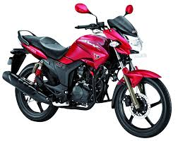
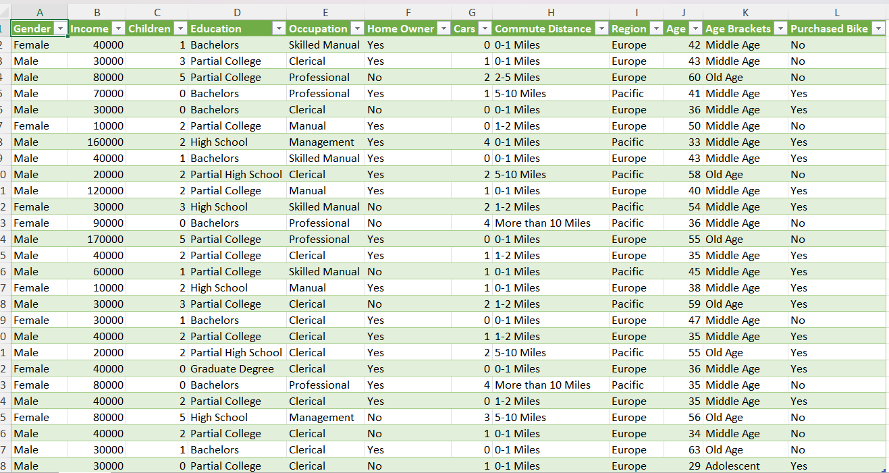
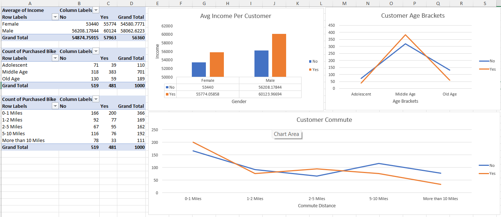
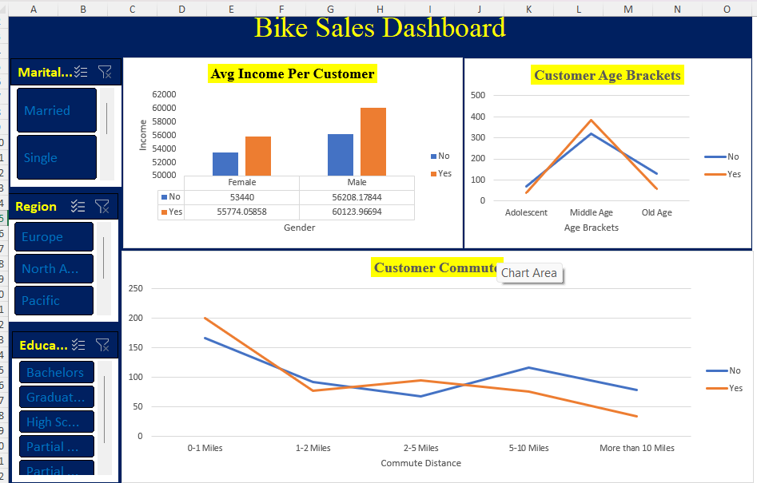

# -Bike-Sales-Dashboard-in-Excel

This project presents a Bike Sales Dashboard built in Microsoft Excel. The dashboard provides insights into customer demographics, income, age distribution, commute distance, and regional trends influencing bike purchases. It was designed using PivotTables, PivotCharts, and slicers to allow interactive analysis of customer behavior
# Project Summary
The Bike Sales Dashboard enables businesses and analysts to understand customer purchasing patterns and the factors affecting bike sales. The analysis is based on customer demographics such as marital status, education level, gender, age, region, and commute distance. By integrating slicers, users can interactively filter the dashboard to reveal insights tailored to specific customer segments.
### Key questions this dashboard answers:
- Does income influence bike purchases across gender?
- How do age brackets impact purchasing decisions?
- What is the effect of commute distance on bike sales?
- How do marital status, education, and region affect customer behavior?
## ✨ Features
- Average Income per Customer – Compare bike purchasers and non-purchasers across genders.
- Customer Age Brackets – Analyze purchasing behavior among adolescents, middle-aged, and older customers.
- Customer Commute Distance – Understand how commute length affects bike purchase decisions.
- Filters (Slicers) – Explore insights by marital status, region, and education level.
## 🛠️ Tools Used
- Microsoft Excel – Dashboard design and analysis.
- PivotTables & PivotCharts – For data summarization and visualization.
- Excel Functions – For calculations and data preparation.
- Slicers & Filters – For interactive exploration of demographics and regions.
## 🔎 Data Preparation
### Raw Data
- Customer demographics (gender, marital status, education, region, age, commute distance).
- Purchase decision (Yes/No).
- Income information.
### Cleaning Steps
- Removed duplicates and missing values.
- Standardized demographic categories (e.g., region, education).
- Ensured consistency in numerical values (income, commute distance).
### Cleaned Data
- Final dataset structured for PivotTables and interactive dashboard creation.
###  **Cleaned Data**

[Downloadhere](Cleaneddata1.png.xlsx)
## Data Analysis (Exploratory Data Analysis – EDA)
Using Excel Pivot Tables and charts, the following analyses were performed:
  ### Average Income by Gender & Purchase Decision
- Compared the average income of male and female customers.
- Insight: Male customers who purchased bikes had the highest average income.
  ### Customer Age Brackets vs. Purchase Decision
- Analyzed bike purchases across different age brackets (Adolescent, Middle Age, Old Age).
- Insight: Middle-aged customers had the highest number of bike purchases compared to other age groups.
  ### Commute Distance vs. Purchase Decision
- Examined how commute distance impacts bike purchase decisions.
- Insight: Customers living within 0–1 miles had the highest likelihood of purchasing bikes.
  ### Purchase Trends by Demographics
- Combined filters such as marital status, education, and region with pivot tables to uncover deeper patterns.
- Insight: Demographic segmentation helped identify which customer groups are more likely to purchase bikes.
## **Pivot Table & Chart**
  
## Dashboard
An interactive dashboard was created to visually explore customer demographics, income levels, commute distances, and their relationship with bike purchase decisions. The dashboard provides a dynamic way to filter and analyze the data for deeper insights.

Access the interactive dashboard here:
[Accesshere](Dashboard1.xlsx)
## Recommendation
Businesses should focus on tailoring marketing strategies toward middle-aged customers with higher income levels and short commute distances, as they represent the most likely segment to purchase bikes.
## 👨‍💻 Author
### Folagbade Olatunbosun Samuel
- 💼 LinkedIn:https://www.linkedin.com/in/olatunbosun-folagbade-559151243/
- 📧 Email:Folagbadeolatunbosun@gmail.com

  
